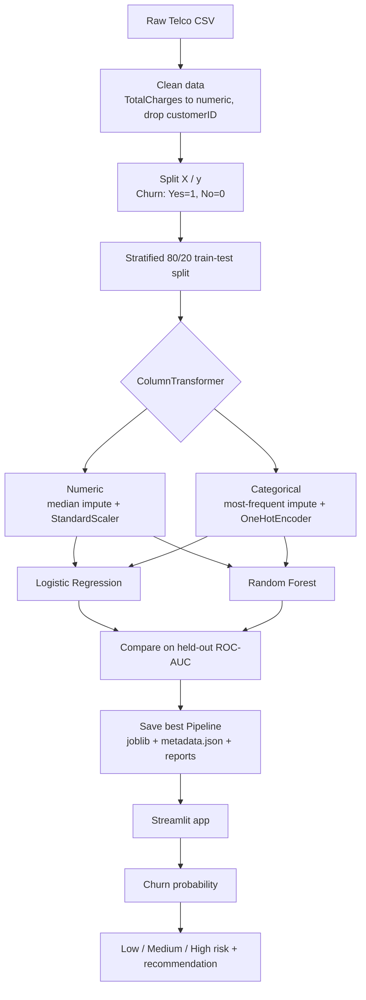

# 📊 ChurnGuard — Customer Churn Prediction & Retention Dashboard


ChurnGuard is an end-to-end machine learning project that predicts whether a telecom customer is likely to leave (churn) and turns that prediction into an actionable **Low / Medium / High risk** score with a suggested retention action, served through an interactive Streamlit dashboard.

> **Business problem:** Acquiring a new customer is typically far more expensive than keeping an existing one. If a retention team can rank customers by churn risk, it can spend its limited budget (calls, discounts, plan reviews) where it matters most.

<!-- Add a screenshot or GIF of the dashboard here:

-->

---

## Table of Contents

- [Highlights](#highlights)
- [Tech Stack](#tech-stack)
- [Dataset](#dataset)
- [Project Structure](#project-structure)
- [ML Pipeline](#ml-pipeline)
- [Results](#results)
- [Getting Started](#getting-started)
- [Using the Dashboard](#using-the-dashboard)
- [Design Decisions](#design-decisions)
- [Limitations](#limitations)
- [Roadmap](#roadmap)
- [Author](#author)

---

## Highlights

- **Leak-free preprocessing.** Imputation, scaling and encoding live inside a single scikit-learn `Pipeline` / `ColumnTransformer`, so they are fit on training data only and applied identically at inference time.
- **Model comparison.** Logistic Regression and Random Forest are trained on the same stratified split and compared on ROC-AUC, accuracy, precision, recall and F1.
- **Class imbalance handled.** Both models use `class_weight="balanced"` because churners are the minority class.
- **One artifact to deploy.** The best full pipeline (preprocessing + model) is saved with Joblib, so the app feeds it raw customer fields with no duplicated feature-engineering code.
- **From probability to action.** The dashboard maps churn probability to a risk tier and a plain-language retention recommendation.
- **Reproducible.** Fixed random seeds, stratified 80/20 split, and auto-generated metric reports.

## Tech Stack

| Area | Tools |
|---|---|
| Language | Python |
| Data | Pandas, NumPy |
| Modeling | scikit-learn (Pipeline, ColumnTransformer, Logistic Regression, Random Forest) |
| Persistence | Joblib, JSON |
| App | Streamlit |

## Dataset

**IBM Telco Customer Churn** (sample dataset): about 7,000 telecom customers with demographics, subscribed services, account/contract details, billing information, and the target column `Churn` (`Yes` / `No`).

1. Download it from Kaggle: [blastchar/telco-customer-churn](https://www.kaggle.com/datasets/blastchar/telco-customer-churn)
2. Place the file at exactly:

```text
data/WA_Fn-UseC_-Telco-Customer-Churn.csv
```

The CSV is intentionally excluded from the repository (see `.gitignore`).

## Project Structure

```text
ChurnGuard/
├── app.py                # Streamlit dashboard (inference + risk tiers)
├── train_model.py        # Training, evaluation, model selection, persistence
├── requirements.txt
├── README.md
├── .gitignore
│
├── data/
│   └── README.txt        # Where to put the dataset
│
├── models/               # Generated by train_model.py
│   ├── churn_model.joblib
│   └── metadata.json
│
└── reports/              # Generated by train_model.py
    ├── model_report.txt
    └── classification_report.txt
```

## ML Pipeline



**Data cleaning notes**

- `TotalCharges` ships as text and contains blank strings for brand-new customers. It is coerced to numeric (blanks become `NaN`) and then median-imputed inside the pipeline.
- `customerID` is dropped: it is an identifier, not a predictive signal.

**Models**

| Model | Key settings |
|---|---|
| Logistic Regression | `max_iter=2000`, `class_weight="balanced"`, `random_state=42` |
| Random Forest | `n_estimators=300`, `max_depth=12`, `min_samples_split=5`, `class_weight="balanced"`, `random_state=42` |

The model with the higher ROC-AUC on the held-out test set is saved as the production model.

## Results

Run `python train_model.py` and paste your numbers from `reports/model_report.txt` here.

| Model | Accuracy | Precision | Recall | F1 | ROC-AUC |
|---|---|---|---|---|---|
| Logistic Regression | _fill in_ | _fill in_ | _fill in_ | _fill in_ | _fill in_ |
| Random Forest | _fill in_ | _fill in_ | _fill in_ | _fill in_ | _fill in_ |

**Selected model:** _fill in_ &nbsp;|&nbsp; Detailed per-class metrics and the confusion matrix are written to `reports/classification_report.txt`.

> **Why ROC-AUC for model selection?** Churn is imbalanced, so accuracy alone is misleading (a model that always predicts "No churn" scores well on accuracy but is useless). ROC-AUC measures how well the model *ranks* customers by risk, which is exactly what a retention team needs. Recall on the churn class matters most when the goal is to catch as many at-risk customers as possible.

## Getting Started

### Prerequisites

- Python 3.10 or newer
- `pip`

### 1. Clone the repository

```bash
git clone https://github.com/sirigirishraddha474-collab/ChurnGuard.git
cd ChurnGuard
```

### 2. Create and activate a virtual environment

```bash
python -m venv venv

# Windows
venv\Scripts\activate

# macOS / Linux
source venv/bin/activate
```

### 3. Install dependencies

```bash
pip install -r requirements.txt
```

### 4. Add the dataset

Download the CSV (see [Dataset](#dataset)) into `data/` using the exact filename `WA_Fn-UseC_-Telco-Customer-Churn.csv`.

### 5. Train the model

```bash
python train_model.py
```

This trains both models, prints the winner, and writes `models/` and `reports/`.

> The trained model is not committed to the repo, so this step is required before launching the app.

### 6. Launch the dashboard

```bash
streamlit run app.py
```

Open the URL shown in the terminal (usually <http://localhost:8501>).

## Using the Dashboard

1. Enter a customer's profile in the sidebar: demographics, tenure, services, contract, billing and charges.
2. Click **Predict Churn Risk**.
3. Review the churn probability, the risk tier and the recommended action.

| Churn probability | Risk tier | Suggested action |
|---|---|---|
| ≥ 70% | 🔴 High | Prioritize for retention: personalized offer, support call, plan review |
| 40% – 70% | 🟠 Medium | Monitor and engage proactively, especially around contract and service fit |
| < 40% | 🟢 Low | No immediate action; continue normal engagement |

The model name and test ROC-AUC shown at the bottom of the app are read from `models/metadata.json`.

## Design Decisions

- **Pipeline over manual preprocessing.** Keeping preprocessing inside the model object removes train/serve skew and makes the saved artifact self-contained.
- **`handle_unknown="ignore"` in the encoder.** The app will not crash if it sees a category not present in training data.
- **Stratified split.** Preserves the churn ratio in both train and test sets, which gives more stable metrics on imbalanced data.
- **Metadata file.** Feature lists and metrics are stored in `metadata.json`, so the UI reads model information instead of hard-coding it.

## Limitations

Being upfront about these is part of using the model responsibly:

- **Model selection uses the test set.** The best model is chosen by test ROC-AUC, so the reported score is slightly optimistic. A cleaner setup would use cross-validation for selection and keep an untouched final test set.
- **Probabilities are not calibrated.** `class_weight="balanced"` shifts predicted probabilities upward, so the 40% / 70% risk thresholds are heuristic cut-offs, not true likelihoods. They should be tuned against real retention costs.
- **Correlation, not causation.** The model estimates risk from historical sample data. It does not prove a customer will leave, nor that a given retention action will prevent it.
- **Single public dataset.** Performance on a real telecom's data may differ, and no drift monitoring is included.
- **Manual inputs.** The dashboard scores one customer at a time and does not check that fields are mutually consistent (for example, `TotalCharges` versus `tenure` × `MonthlyCharges`).

## Roadmap

- [ ] Add cross-validation and hyperparameter search, with a held-out final test set
- [ ] Probability calibration and threshold tuning based on retention cost vs. customer lifetime value
- [ ] SHAP explanations for individual predictions
- [ ] CSV batch scoring
- [ ] Gradient boosting baselines (XGBoost / LightGBM)
- [ ] Unit tests and CI via GitHub Actions
- [ ] Dockerfile and Streamlit Community Cloud deployment
- [ ] Model monitoring and drift detection

## Author

**Sirigiri Shraddha**
Aspiring Machine Learning Engineer

- GitHub: [@sirigirishraddha474-collab](https://github.com/sirigirishraddha474-collab)

---

*ChurnGuard is a portfolio / educational project built with Python, Pandas, scikit-learn and Streamlit.*
